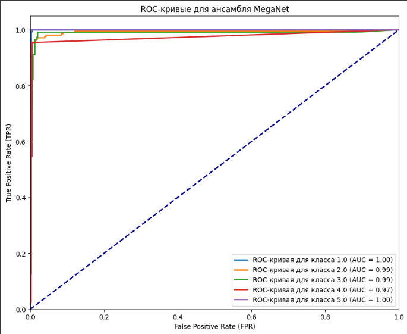
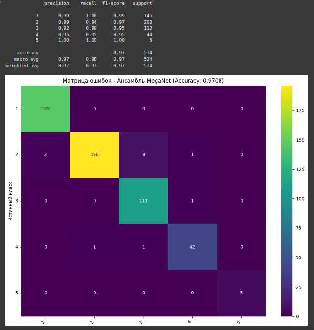
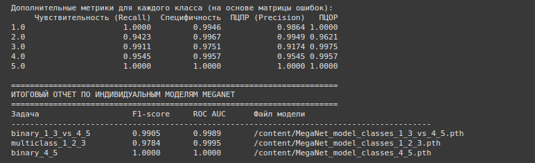

# 🌟 megnet-deployment: Микросервис для модели MegaNet


**Микросервис на базе FastAPI для запуска гибридной нейросети MegaNet, предназначенной для классификации табличных данных, с возможностью развертывания через Docker.**

---

## 📝 Описание проекта

`megnet-deployment` — это микросервис, предоставляющий API для инференса модели MegaNet, разработанной для обработки сложных табличных данных. Проект включает:
- FastAPI-бэкенд с эндпоинтом для предсказаний.
- Ансамбль моделей MegaNet для бинарной и многоклассовой классификации.
- Docker-конфигурацию для простого развертывания.
- Поддержку CPU (с опциональной поддержкой GPU).

---

## 📂 Структура проекта

```
src/models/ — реализация модели MegaNet и веса (.pth файлы)
src/server/ — FastAPI сервер с API для инференса
docker-compose.yml — конфигурация Docker
Dockerfile — инструкции для сборки образа
requirements.txt — зависимости Python
images/ — изображения для документации (логотип, ROC-кривые, матрица ошибок, метрики)
```

---

## 🚀 Установка и запуск

### 1. Клонирование репозитория
```bash
git clone https://github.com/ToshiroRikishi/megnet-deployment.git
cd megnet-deployment
```

### 2. Установка зависимостей (без Docker)
Создайте и активируйте виртуальное окружение:
```bash
python3 -m venv venv
source venv/bin/activate  # Linux/macOS
venv\Scripts\activate     # Windows
pip install -r requirements.txt
```

### 3. Запуск через Docker
Соберите и запустите контейнер:
```bash
docker-compose up --build
```

## 🌐 Доступ к приложению

- **API бэкенда**: [http://localhost:8080](http://localhost:8080)
- **Документация API**: [http://localhost:8080/docs](http://localhost:8080/docs)
- **Healthcheck**: [http://localhost:8080/health](http://localhost:8080/health)

---

## 🛠️ Использование

### Эндпоинты API

- **POST /predict_ensemble**:
  - **Описание**: Выполняет предсказание с использованием ансамбля моделей MegaNet.
  - **Вход**: JSON с полем `values` (список из 8 чисел с плавающей точкой).
  - **Пример запроса**:
    ```bash
    curl -X POST "http://localhost:8080/predict_ensemble" -H "Content-Type: application/json" -d '{"values": [1.0, 2.0, 3.0, 4.0, 5.0, 6.0, 7.0, 8.0]}'
    ```
  - **Выход**: JSON с полем `predicted_class` (целое число от 1 до 5).
  - **Пример ответа**:
    ```json
    {"predicted_class": 1}
    ```

- **GET /health**:
  - **Описание**: Проверяет состояние сервиса.
  - **Пример запроса**:
    ```bash
    curl http://localhost:8080/health
    ```
  - **Пример ответа**:
    ```json
    {"status": "healthy"}
    ```

### Пример работы с API
1. Откройте [http://localhost:8080/docs](http://localhost:8080/docs) для интерактивной документации.
2. Отправьте тестовый запрос к `/predict_ensemble` с вектором из 8 чисел, соответствующих входным данным модели.

---

## 🧠 MegaNet — Гибридная нейросеть для сложных табличных данных

MegaNet — это кастомная нейросетевая архитектура, разработанная для продвинутой обработки табличных (structured) данных. Она сочетает в себе элементы из разных подходов: трансформеры, VAE, квантовые суперпозиции, эволюционные пути и диффузионные блоки, что делает её мощным инструментом для задач классификации.

### 🔧 Архитектура включает:
- **Общий эмбеддинг**: Нормализует и проецирует входные данные в общее пространство признаков.
- **Transformer-ветка**: Захватывает контекст и зависимости между признаками.
- **VAE-ветка**: Обучается восстанавливать входные данные и вводит стохастику через латентное пространство.
- **Квантовая ветка**: Эмулирует суперпозицию и запутанность состояний, обрабатывая информацию в параллельных представлениях.
- **Эволюционная ветка**: Динамически объединяет выходы из разных блоков, имитируя естественный отбор признаков.
- **Диффузионная ветка**: Использует глубинные остаточные блоки для сложной трансформации признаков.
- **Fusion-слой**: Объединяет все представления перед финальной классификацией.

### 🎯 Основное применение
Модель нацелена на бинарную или многоклассовую классификацию табличных данных, где важно учесть сложные связи между признаками и устойчиво работать с шумами.

### 📈 Метрики производительности




---

## 📌 Примечания

- Все веса моделей (`MegaNet_model_classes_1_3_vs_4_5.pth`, `MegaNet_model_classes_1_2_3.pth`, `MegaNet_model_classes_4_5.pth`) включены в образ Docker и находятся в `src/models/`.
- Для работы на GPU замените базовый образ в `Dockerfile` на `pytorch/pytorch:2.0.0-cuda11.7-cudnn8-runtime` и добавьте конфигурацию GPU в `docker-compose.yml`:
  ```yaml
  deploy:
    resources:
      reservations:
        devices:
          - driver: nvidia
            capabilities: [gpu]
  ```
- Убедитесь, что порт `8080` открыт на сервере:
  ```bash
  sudo ufw allow 8080
  ```

---
## 🤝 Контрибьютинг

1. Сделайте форк репозитория.
2. Создайте ветку:
   ```bash
   git checkout -b feature/ваша-фича
   ```
3. Закоммитьте изменения:
   ```bash
   git commit -m "Добавление новой фичи"
   git push origin feature/ваша-фича
   ```
4. Отправьте Pull Request на GitHub.

---

## 📧 Контакты

Для вопросов или предложений свяжитесь с автором: yanrikishi@gmail.com.

---

